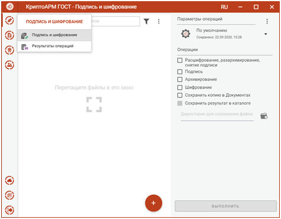
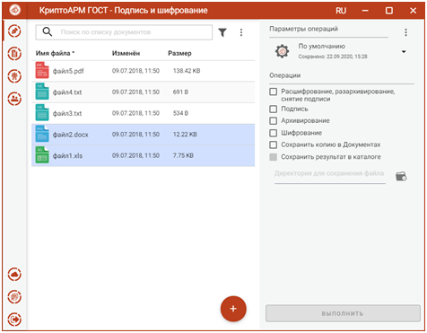
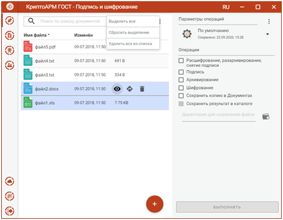
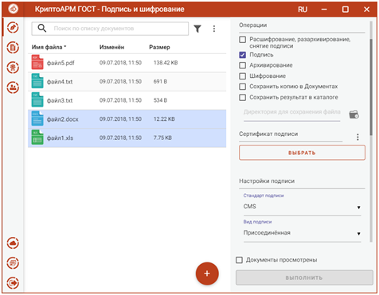

# 5. Графический пользовательский интерфейс приложения

 <b> 5.1. Начало работы с приложением </b>

Работа с приложением КриптоАРМ ГОСТ начинается со страницы **Подпись и
шифрование**.

Левая рабочая часть окна предназначена для управления списком файлов; в правой
части располагается панель выбора **Параметров операций**, переключатель
**Операций** и кнопка **Выполнить.**

Переключатель операций позволяет выбрать группу операций, которая будет
выполняться над списком файлов:

-   **Расшифрование, разархивирование, снятие подписи** – опция для выполнения
    обратных операций. Для выполнения обратных операций не требуется установка
    дополнительных параметров.

-   **Подпись, архивирование, шифрование** – опция для выполнения прямых
    операций. Допускается выбор одной операции или группы операций. Для прямых
    операций требуется выбор дополнительных параметров подписи и шифрования.

-   **Сохранить копию в Документах, Сохранить результат в каталоге** – для
    сохранения результатов прямых операций в заданные каталоги.

Слева на панели расположены кнопки выбора пунктов меню приложения, через которые
можно выполнить переход ко всем представлениям.

При первом запуске приложения в домашней папке пользователя создается подкаталог
с наименованием **.Trusted**, который содержит файловые объекты, необходимые для
корректного функционирования приложения. В частности, в подкаталоге размещаются
файлы журнала операций и каталог с документами. В файле **settings.json**
сохраняются пользовательские настройки.

 <b> 5.2. Создание электронной подписи </b>

Подписать файлы можно на странице **Подпись и шифрование**. Для этого нужно
выбрать подписываемые файлы, сертификат подписи и задать параметры подписи.

## Выбор подписываемых файлов

В приложении доступно создание подписи для одного или группы выбранных файлов.
Файлы для подписи можно добавить двумя способами: через кнопку **Добавить** (+)
или перетащив мышкой в область формирования списка файлов.

Выбранные файлы заносятся в левую область и представляют собой одноуровневый
список.

Для данного списка доступны поиск, фильтрация, управление файлами через
контекстное меню и кнопки для каждого файла.

## Установка параметров подписи

Для подписи файлов в разделе **Операции** необходимо выбрать опцию **Подпись**,
становятся доступны параметры подписи.

В параметрах можно настроить:

-   **Сертификат подписи** – личный сертификат с закрытым ключом.

-   **Стандарт подписи** – CMS для создания классической подписи или CAdES-X Long Type 1 - для усовершенствованной подписи. При выборе стандарта CAdES-X
    Long Type 1 требуется заполнить поля в разделе **Служба штампов времени
    (TSP)**. Стандарт подписи CAdES-X Long Type 1 доступен только при установленных модулях КриптоПро TSP Client и
    КриптоПро OCSP Client.

-   **Вид подписи** – присоединённая или отсоединённая.

-   **Кодировка** - сохранение подписи в одной из двух кодировок BASE64 или DER.

-   **Штамп времени на подпись** – предназначен для создания подписи со штампом
    времени на подпись. При установке флага требуется заполнить поля в разделе
    **Служба штампов времени (TSP)** (подробно в пункте [Создание подписи со
    штампом времени](#_Создание_подписи_со)). Данная опция доступна только при
    установленном модуле КриптоПро TSP Client.

-   **Штамп времени на подписанные данные** – предназначен для создания подписи
    со штампом времени на данные. При установке флага требуется заполнить поля в
    разделе **Служба штампов времени** **(TSP)** (подробно в пункте [Создание
    подписи со штампом времени](#_Создание_подписи_со)). Данная опция доступна
    только при установленном модуле КриптоПро TSP Client.

Можно задать каталог для сохранения подписанных документов, выбрав в операциях
опцию **Сохранить результат в каталоге.** При установке флага становится
доступно поле выбора каталога.

****

Выбор каталога для сохранения результата операции подписи

Если флаг не установлен, то файл сохраняется рядом с исходным файлом.

Опция **Сохранить копию в Документах** служит для сохранения копии полученного
после операции файла в специальный каталог Documents, расположенный в папке
пользователя в каталоге ./Trusted/CryptoARM GOST/. Файлы из данного каталога
доступны в пункте меню **Документы**.

Выбранные параметры подписи можно сохранить и использовать при последующих
запусках приложения. Процесс сохранения и изменения параметров описан в пункте
[Управление параметрами операции](#_Управление_параметрами_операции).

### **Выбор сертификата подписи**

Для того, чтобы выполнить подпись необходимо выбрать сертификат, к которому
привязан закрытый ключ. Эта операция производится нажатием кнопки **Выбрать**
сертификат подписи. В появившемся диалоговом окне отображаются сертификаты
категории **Личные**, которые могут использоваться для подписи.

Выбор сертификата подписи

Выбор сертификата подписи осуществляется его выделением и нажатием на кнопку
**Выбрать**.

Сертификат подписи можно изменить с помощью контекстного меню.

Изменение сертификата подписи

Если в хранилище личных сертификатов нет сертификата с закрытым ключом, то можно
его создать или импортировать в разделе
[Сертификаты](#_Управление_параметрами_операции).

### **Подпись файлов**

При условии выбора сертификата подписи, файлов и установленного флага, что
**Документы просмотрены**, в мастере становится доступной кнопка **Выполнить**.
Подписать можно любые файлы, кроме зашифрованных.

Подпись файлов

Нажатие на кнопку **Выполнить** запускает процесс подписи. Исходные документы
(оригиналы) и результаты операции отображаются в отдельном мастере **Результаты
операций**.

Результаты операции подписи

Подписанные файлы сохраняются в заданном каталоге, если в операциях был выбран
каталог для сохранения результатов. Или рядом с исходным файлом, если в
операциях не был установлен флаг **Сохранить результат в каталоге**.

Если в операциях был установлен флаг **Сохранить копию в Документах**, то копия
полученного после операции файла сохраняется в специальный каталог Documents,
расположенный в папке пользователя в каталоге ./Trusted/CryptoARM GOST/. Файлы
из данного каталога доступны в пункте меню **Документы**.

Подпись проверяется автоматически.

Для просмотра информации о подписи нужно выделить один файл в списке.

Для каждого документа доступны операции:

-   **Просмотр** - выполняется открытие файла через приложение, которое
    ассоциировано с его расширением. Для подписанных файлов открывается оригинал
    документа;

-   **Проверить подпись** – доступна только для подписанных файлов.
    Принудительно запускает процесс проверки подписи;

-   **Перейти к файлу** - выполняется открытие каталога, в котором располагается
    файл.

Операции для документа

Для списка документов доступно контекстное меню, позволяющее выделить файлы по
типу операции.

Выделение группы файлов по типу файла

Документ из **Результатов операций** можно **Открыть в мастере Подписи и
шифрования** для выполнения других операций**.** Операция **Сохранить копию в
Документах** служит для сохранения копии полученного после операции файла в
специальный каталог Documents, расположенный в папке пользователя в каталоге
./Trusted/CryptoARM GOST/. Файлы из данного каталога доступны в пункте меню
**Документы**.

После выполнения операции мастер **Подписи и шифрования** очищается от
добавленных в него файлов. Результаты операций сохраняются до выполнения
следующей операции или до закрытия приложения и доступны в меню **Подпись и
шифрование - Результаты операций**.

